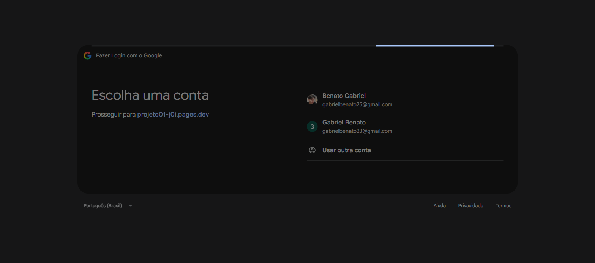

# Início do login com Google

Acessei `https://projeto01-j0i.pages.dev/oauth/login/google` e o navegador foi redirecionado direto pra tela de escolha de conta do Google, o que já mostra que o redirect está funcionando:



Pra conferir os headers da resposta (sem o navegador seguir o redirect), rodei pelo terminal:

```
curl -sD - -o /dev/null https://projeto01-j0i.pages.dev/oauth/login/google
```

E o que voltou foi isso (removi os valores de `state`, `nonce`, `code_challenge` e do cookie, como pedido no enunciado):

```
HTTP/2 302
location: https://accounts.google.com/o/oauth2/v2/auth?client_id=1029740697662-carvp5vthbiik7ujtinff0tl3voiv267.apps.googleusercontent.com&redirect_uri=https%3A%2F%2Fprojeto01-j0i.pages.dev%2Foauth%2Fcallback%2Fgoogle&response_type=code&scope=openid+email+profile&state=[REMOVIDO]&nonce=[REMOVIDO]&code_challenge=[REMOVIDO]&code_challenge_method=S256
set-cookie: __Host-oauth-tx=[REMOVIDO]; Path=/; HttpOnly; Secure; SameSite=Lax; Max-Age=600
```

Conferindo com o que o Ponto de verificação 1 pede:

- Status é 302, redirecionando pro Google de verdade (`accounts.google.com`), não ficou nada renderizado do lado da minha aplicação.
- O cookie temporário `__Host-oauth-tx` é criado com `HttpOnly`, `Secure` e `SameSite=Lax`, e expira em 600 segundos (10 minutos).
- `redirect_uri` bate exatamente com a URL cadastrada no Google Cloud Console.
- `response_type=code` (fluxo Authorization Code, não implicit).
- `code_challenge_method=S256`, confirmando que o PKCE está sendo usado.
- Não aparece client secret nem code_verifier em nenhum lugar da URL — só o `code_challenge`, que é o esperado.
