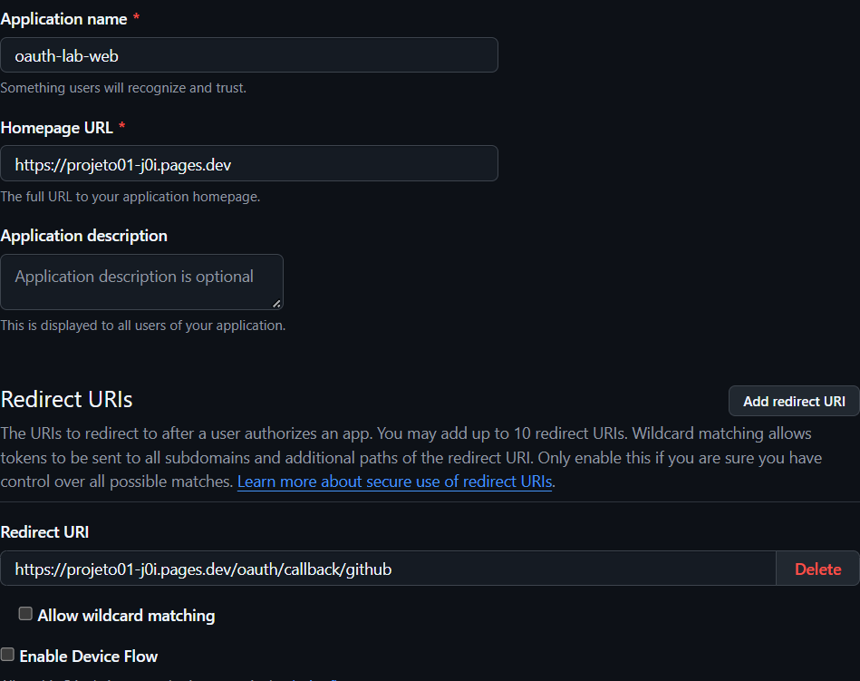

# Início do login com GitHub

Testei `https://projeto01-j0i.pages.dev/oauth/login/github` do mesmo jeito. Como esse navegador já tinha autorizado o app antes (durante os testes anteriores), o GitHub pula a tela de consentimento e volta direto autenticado — é o comportamento normal do OAuth quando o app já foi autorizado, não um bug. Por isso não dá pra printar a tela de "Authorize" de novo sem revogar o acesso do app, e não quis mexer nisso já que está tudo configurado certo.

Então a evidência aqui é o print da própria configuração do OAuth App no GitHub, confirmando que está tudo certo (URL de callback, Device Flow desativado):



E os headers reais do redirect, capturados via terminal:

```
curl -sD - -o /dev/null https://projeto01-j0i.pages.dev/oauth/login/github
```

```
HTTP/2 302
location: https://github.com/login/oauth/authorize?client_id=Ov23lilWS6c6NSiW1K27&redirect_uri=https%3A%2F%2Fprojeto01-j0i.pages.dev%2Foauth%2Fcallback%2Fgithub&response_type=code&scope=read%3Auser&state=[REMOVIDO]
set-cookie: __Host-oauth-tx=[REMOVIDO]; Path=/; HttpOnly; Secure; SameSite=Lax; Max-Age=600
```

Conferindo com o Ponto de verificação 1:

- 302 redirecionando pro `github.com` de verdade.
- Cookie temporário `__Host-oauth-tx` com `HttpOnly`, `Secure`, `SameSite=Lax`, expira em 600s.
- `redirect_uri` bate com o que está cadastrado no GitHub (mostrado no print acima).
- `response_type=code`.
- O GitHub OAuth clássico não usa PKCE (não tem `code_challenge` na URL), então a proteção contra CSRF nesse fluxo fica por conta do `state`, que está presente.
- Nenhum client secret aparece na URL.
